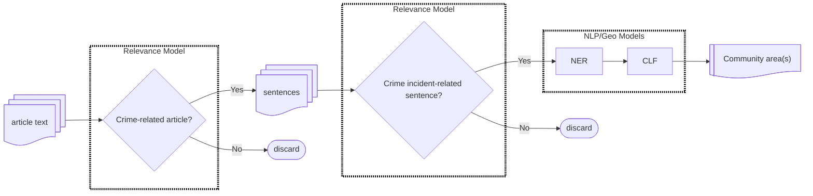

## Introduction

According to Pew Research, crime is the second-most watched news topic besides
weather. Over three quarters of U.S. adults say get news about crime sometimes
or often.[^1] How accurate is this information? How does it affect public perceptions
on crime? And how, ultimately, does that affect public safety conversations,
economic behaviors, and social good.

Decades of social science research have shown the importance of
news coverage in shaping our world views. The media helps determine what issues 
are important and deserve *attention*, a process called "scheduling". 
Within each story, journalists also decide what aspects to focus on, 
showing readers how to make meaning of this information,
and "framing" the story in a particular set of values.[^2]

### Perceptions of crime
Decades of opinion research have also shown a consistent disconnect between
fear of crime victimization and actual crime rates. 
For the past 29 out of 31 years, a majority of U.S. adults have said that crime
is worse this year than last year.[^3] This is despite official statistics showing
consistent decreases in violent crime rates over time.

Overall, fear of victimization has remained a salient issue, with 
46% of adults describing crime in their area as being an extremely to somewhat serious problem.
These perceptions cut across types of crime:
69% of households report that they frequenty or occasionally worry about 
identity theft, 30% worry about muggings, 21% worry about sexual assault.

### Experience with crime
Violent crimes are overall much rarer than property crimes. Comparatively,
certain white-collar and cyber-crimes are surprisingly ubiquitous.
Three percent of households report being victims of physical assault or mugging, and 2% of sexual assault. 
On the other hand, 13% percent report being victims of vandalization,
whereas 24% of households have report being victims of credit card
hacking, 15% of financial scams, 14% of identity theft. 

Perceptions of crime have immediate effects on behavior, with longer term
systemic implications carrying over to other policy realms.
For instance, almost half of U.S. adults claim to avoid certain places or neighborhoods
due to concern over crime and 32% report having bought a gun for protection.[^3]

### Accuracy of media coverage
Survey after survey consistently show a positive correlation between percieved victimization risk and news consumption.[^5]
Whether one causes the other, or vice versa, is an empirical question. 
50% of adults say the media neither over nor under reports crime.
Given this link, it is important to investigate, 
does the coverage of crime reflect actual crime rates? Are locations and types
of crimes accurately represented?

The Chicago Justice Project has previously highlighted
[disparities](https://chicagojustice.org/2013/05/20/violence-against-women-reporting/)
in stranger vs intimate partner violence rates compared to the types of cases that are covered.

### Literature Review
Previous studies have relied mostly on opinion surveys. Succar et. al. 
analyze Twitter streams by counting the number of tweets mentioning crime-specific
keywords, and performing a sentiment analysis on police/crime-related tweets.[^4]

The Quantify Justice News project extends their methods in two ways. First, we analyze the content
of news articles, specifically the locations of reported crimes. Second, we
train a machine learning model to classify articles as crime-related, rather
than relying on exact keyword matches.

## Methods

Using a database of daily local news articles covering the Chicagoland area, 
I trained a machine learning pipeline to analyze:

*What locations (community areas) covered in news of crime?*

Why community areas? For privacy concerns, crime events are not published with
exact addresses. Community areas are stable administrative boundaries designed
for long-term policy analysis and planning.

### ML Tasks
Following this excellent talk from the folks at [Spacy](https://support.prodi.gy/t/fact-extraction-for-earnings-news/1023/2)
I've broken down this research question into simpler sub-tasks that are easier to verify
and easier to train a ML model to do. 

1. Is the article crime-related?[^6] (classification)
2. Which sentences in the article describe the crime *incident*? (classification)
3. Which words refer to a location? (named entity recognition)
4. Which locations relate to the crime *incident*? (dependency parsing)
5. Which neighborhood is this in? (classification)

In graphical form:

For a more in-depth discussion of this model and implementation,
see my [next post](../qjn-methods/index.html).

## Results

*Coming Soon!*

[^1]: https://www.pewresearch.org/short-reads/2024/08/29/the-link-between-local-news-coverage-and-americans-perceptions-of-crime/
[^2]: https://doi.org/10.56238/sevened2023.006-152
[^3]: https://news.gallup.com/poll/1603/Crime.aspx
[^4]: https://www.nature.com/articles/s44271-024-00059-8
[^5]: https://link.springer.com/article/10.1007/s10940-015-9261-x
[^6]: This imposes a strong framing on the analysis. 
Why crime news instead of all public-safety news
(ie. accidents, road closures, changes in police department policy)? What types
of crime (e.g. labor and environmental violations)?