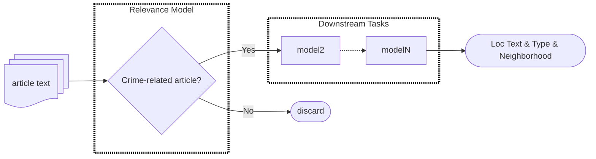

I've been volunteering on a civic technology project measuring the differences
between **crime news reporting** and official victimization rates in Chicago. 
This research builds on previous 
[reports](https://chicagojustice.org/2013/05/20/violence-against-women-reporting/)
highlighting disparities in stranger vs intimate partner violence rates
compared to the types of cases that are covered.

How do we measure these differences? Using a database of local media articles,
we have enlisted volunteers from across the community to read and annotate 
whether the articles are **crime-related**, the types of crimes reported, and their
**locations**.

These high-quality annotations are essential, but laborious. Keeping the database
up-to-date would require an unrealistic time commitment. Here we can turn to
tried and true methods from **machine learning** to essentially replicate the 
knowledge and experience of our volunteers and apply it to a larger set of
articles.

The rest of this post explains a few technical design choices I've encountered
while implementing and training this machine learning approach. If you're
interested in substantive public-safety insights, this article won't be very interesting.
If you want to know if I can do the machine learning thing, read on!

# The Task

*Given a news article title and body text, locate the community area where the crime was reported to occur.*

Following this excellent talk from the folks at [Spacy](https://support.prodi.gy/t/fact-extraction-for-earnings-news/1023/2)
I've broken down this task into simpler sub-tasks that are easier to verify
and easier to train a ML model to do. 

1. For each article: Is the article crime-related?[^1] (classification)
    
    <!-- a. If no -> discard.  -->
    
    <!-- b. If yes -> continue. -->

2. For each sentence: Is the sentence crime-related? (classification)
    
    (This filters out extraneous locations mentioned in other parts of the article)        
    
    <!-- a. Collect all incident-related sentences. -->

3. For each word: Does this word refer to an action? (part of speech OTS)

    <!-- a. Collect all action words. -->

4. For each action word: Does this word refer to a criminal action? (classification)

    <!-- a. Collect all criminal action words. -->

5. For each word: Does this word refer to a location? (named entity recognition)
    
    <!-- a. Collect all location words. -->

6. Which locations are semantically related to a criminal action? (dependency parsing OTS)

    <!-- a. Collect all crime-related locations. -->

7. For each crime-related location: Which neighborhood is this in? (classification)

    <!-- a. Return neighborhoods covered in media crime reports. -->

# Task Pipeline

The ML task breakdown describes a flow:



With a conditional data flow like this, each model needs to be trained on 
data it will actually see (ie. data that has passed through previous components).
Despite this bottleneck, each model can still be independently prototyped on 
synthetic or unfiltered upstream data. But we won't be able to estimate the
true overall performance until each component has been implemented and trained
in sequence.

# Article Classifier

Each component of this pipeline requires its own data pre-processing, training,
evaluation, and tuning steps. I'm using [Dagster](https://dagster.io/) to explicitly
declare and manage these data processing and modeling steps as a pipeline.


## Pipeline

I have a bias towards file-centric pipeline declarations like Makefiles and [dvc](https://dvc.org/doc/user-guide/pipelines/defining-pipelines). These methods encourage making your processing code agnostic
as to *where* data is located. Especially with dvc, it's very easy to quickly scan the 
order that different files are created and the relationships between inputs, processing, and outputs. 

### Data Discovery

I follow those concepts in my dagster definitions. First, I define all data paths
in an external config file, which is organized by stage:

```yaml
# data_sources.yaml
raw:
  article_text: "raw/articles.parquet"
pre_relevance:
  article_text: "pre_relevance/articles.parquet"
art_relevance:
  article_text_prototype: "art_relevance/articles_prototype.parquet"
  article_text_preproc: "art_relevance/articles_preproc.json"
```

Notice how these paths are *relative*. This allows the data folder itself to 
be environment-specific, which is checked when the config is loaded. (For 
local development it is just "./data" within the project folder. For running on
Colab, it is a Google Drive path "/gdrive/MyDrive/.../data").

```python
from scripts.utils import Config
config = Config()
print(config.get_data_path("raw.article_text"))
"/absolute/path/to/project/data/raw/newsarticles.parquet"
```

### Stage Declarations

Next I define my dagster stages. The goal is to make this file really compact
and to highlight a) the logical stage dependencies and b) the input output 
flows. To achieve this, I separate the actual processing logic to a different
file `operations.py`. And as before, the actual data locations are
isolated and loaded through the config file. 

```python
# scripts/art_relevance/assets.py
import dagster as dg
from scripts.utils import Config
from scripts.art_relevance import operations as ops
config = Config()
@dg.asset
def extract():
    dep_path = config.get_data_path("raw.zip")
    out_path = config.get_data_path("raw.article_text")
    ops.extract(dep_path, out_path)

@dg.asset(deps=[extract], description="Filter using external relevance model")
def pre_relevant():
    dep_path = config.get_data_path("raw.article_text")
    out_path = config.get_data_path("pre_relevance.article_text")
    ops.pre_relevant(dep_path, out_path)
```

This way the processing functions (ops) can be arbitrarily complicated, but
`assets.py` makes it very clear how they should be chained.

## Training

The volunteer-contributed training data for this project addresses the 
high-level end-to-end task. Unfortunately these data wouldn't be very helpful
to train each sub-task model because each model sees a different conditional subset of the data.

The idea is to prototype each sub-model quickly, get a sense of the overall performance,
get a sense of which sub-units need improvement. As you saw in the dagster diagram, 
I've inserted a "prototype_sampling" stage which picks 200 random records to
use as a working set to develop the first model. I export these to 
[Label Studio](https://labelstud.io/) and spend an hour annotating.


*A positive example.*


*A negative example.*

I am using [MLFlow](https://mlflow.org/) to track model experiments. I load
the spacy config file, flatten it like `{"nested.key.param1": val1, "nested.key.param2": val2}`
and dump the full parameter list into MLFlow. Spacy provides a convenient function
`spacy.util.load_config(path, overrides: dict)`
making it easy to alter the configuration in-memory instead of writing each change
to disk. Even though 99.9% of the values are unchanged run-to-run, 
this way I'm never missing a baseline parameter value if I run a new experiment.

So far I've tested limited-scope changes (ie. doesn't require different pre/post processing).
Besides the "quickstart" model using the default spacy configs, I'm using 
[Optuna](https://optuna.readthedocs.io/) for hyperparameter tuning. And of course
a baseline "null_model" which simply measures the frequency of positive values 
in the training set and predicts the positive class with that likelihood. 


At this point, with only 160 training
and 20 dev examples, there isn't enough variation in the data itself for the
hyperparameters to impact the model's performance.

# Next Steps - Sentence Classifier

I will pull a new set of a few hundred articles, filter them through the
article-classifier prototype, and use the "relevant" articles to train the next task.
With this prototype 29% of the articles it passes to the next stage will be irrelevant, meaning more
wasted time in Label Studio. 

Many articles (e.g. sports) use violence-laden language to describe non-criminal acts. These cases will
likely confuse the model at the sentence-level, which is why I attempted filtering at the
article-level. Hopefully these cases will not severely degrade the sentence-level
model too much.

On the bright side, this prototype is an improvement over the externally labeled
`pre_relevance` stage, which had a precision of 36%. Since the next model is also
a text classifier, I can re-use a lot of the pipeline and training aparatus from
this stage.


[^1]: This question deserves further examination. Why crime news instead of all public-safety news
(ie. accidents, road closures, changes in police department policy)? What types
of crimes (ie. do white collar cases like bribery count)? Is the word "crime"
appropriate before a judge reaches a legal finding?